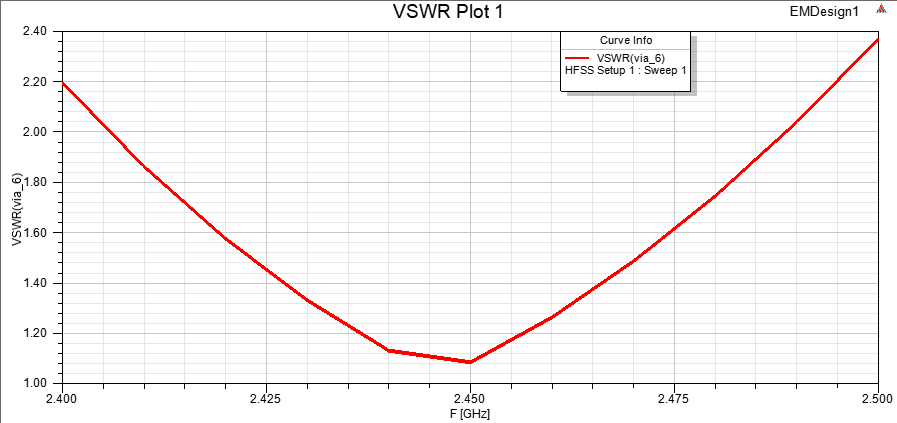
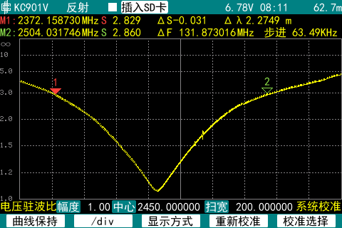
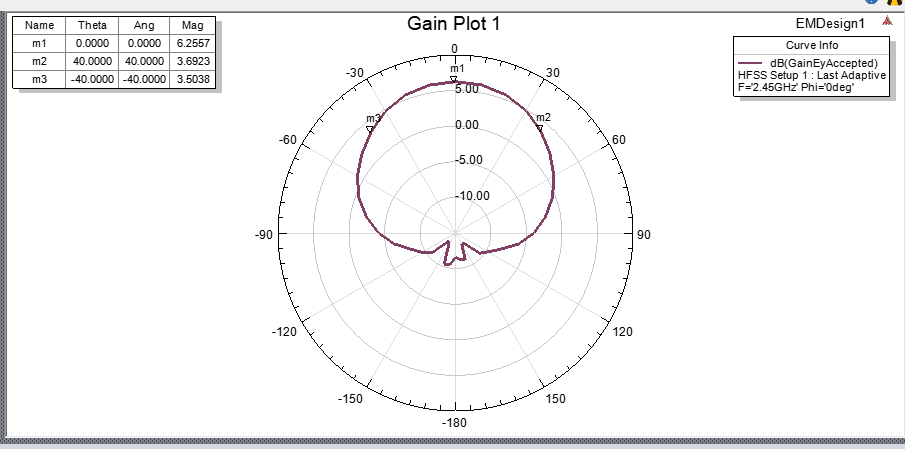
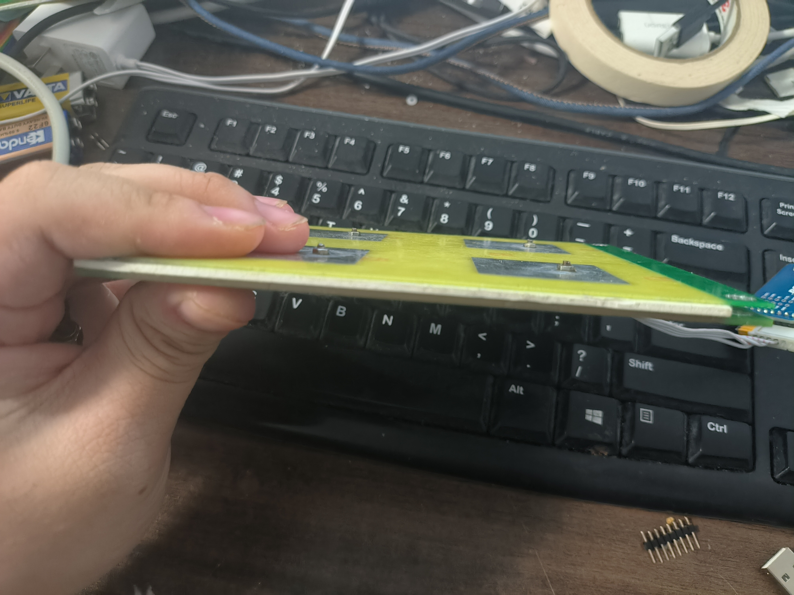
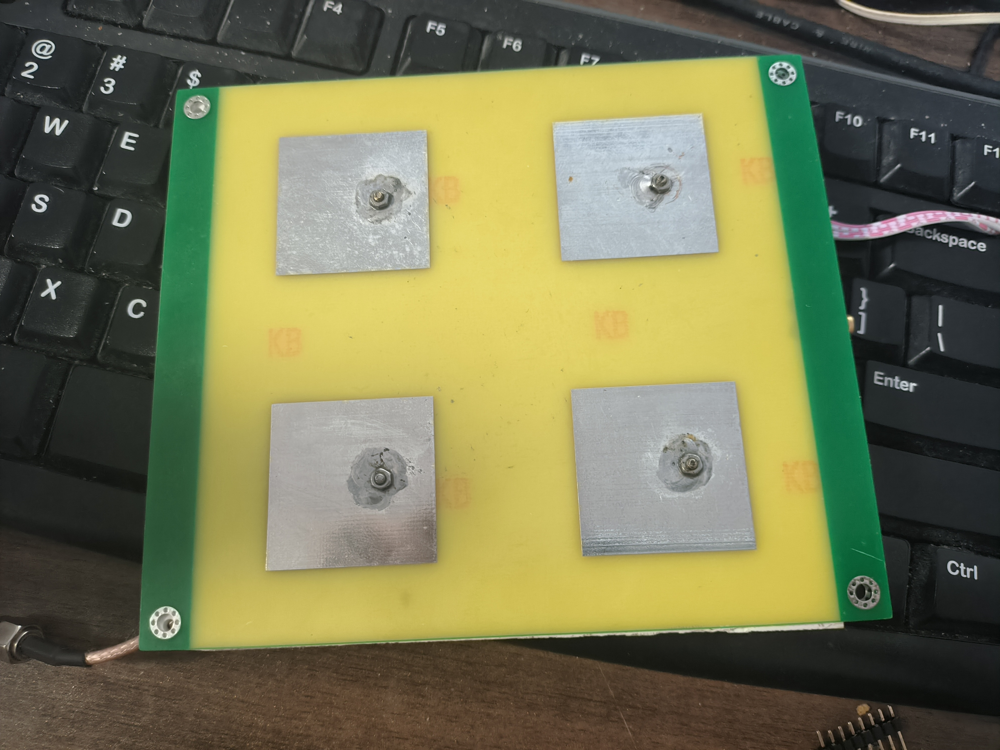

# 天线结构
- 线极化介质贴片天线
- 中心频点：2.45GHz
- 带宽：100MHz
- 增益：6.25dbi(仿真指标)
- 辐射效率:84%(仿真指标)
- 3db波束宽度:±40°(仿真指标)
- 单个阵元增益：6.25dbi(仿真指标)
- VSWR（仿真）：
- 
- VSWR（实测）：
- 
- 方向图（仿真）：
- 2x2单元阵列互耦(仿真)：-17.7db

# 加工工艺

- 天线PCB板：嘉立创二层板 板厚1.0mm

- 介质片：2mm 聚苯乙烯板  https://item.taobao.com/item.htm?id=654914684556

- 天线PCB板通过M2螺丝连接到TR组件板 TR组件板的Top层同时也作为天线的地平面

- 天线用M3螺丝与机械结构进行固定

- 实物图：

- 

  

# 仿真软件版本

- Ansys Electromagnetics Suite 19.1